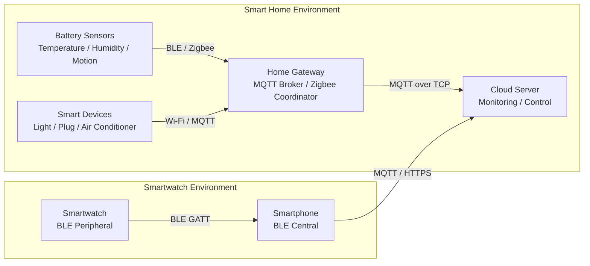
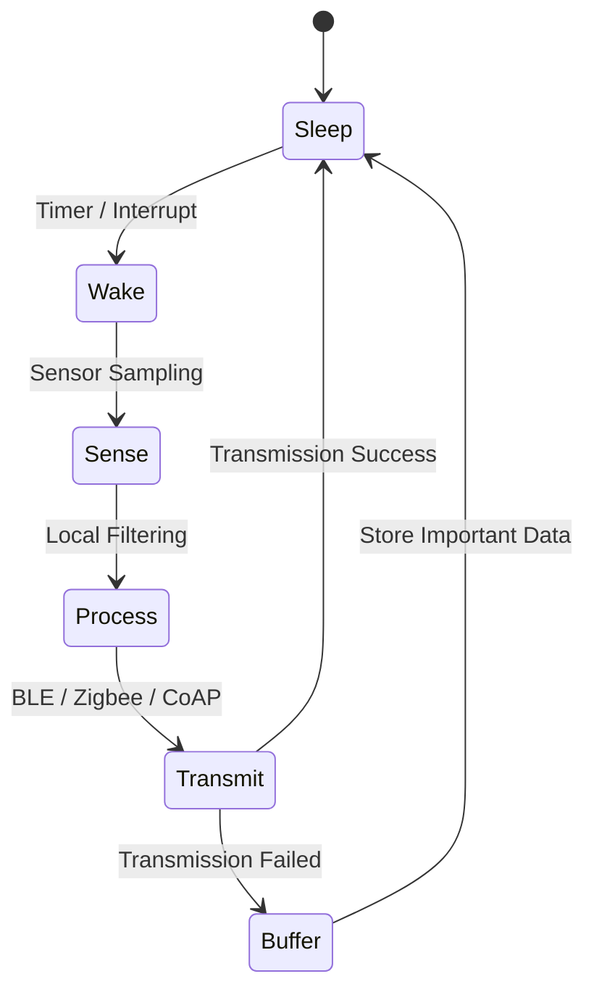
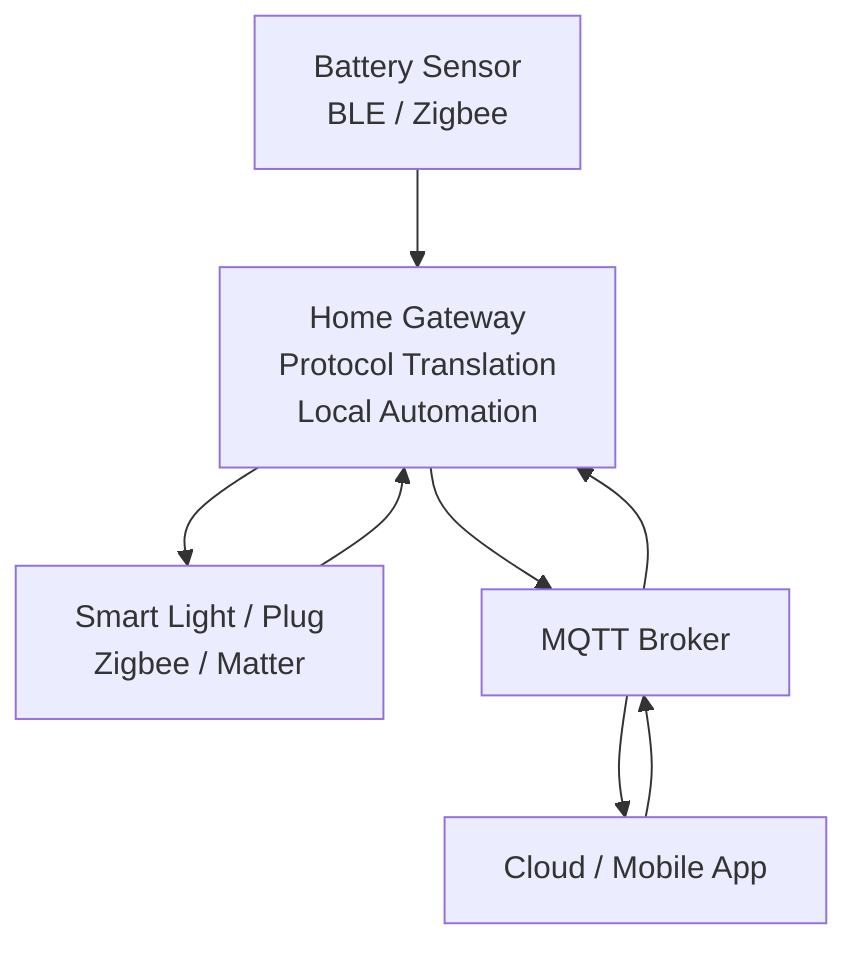
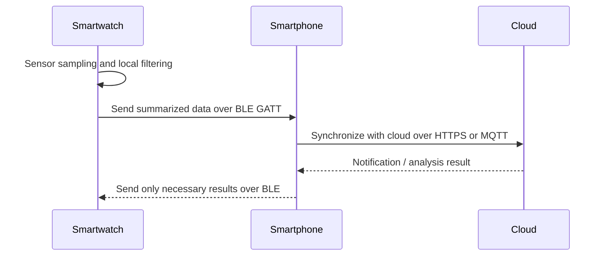

# Low-Power IoT Communication

**How IoT Systems Stay Connected While Using as Little Energy as Possible**

> Course: Computer Networks (DCCS 307)  
> Team: Group 5  
> Presentation Video: [Watch Here](https://drive.google.com/file/d/1lYzUxbq11MzKErFVEkW2tJlV6To6xhxG/view?usp=sharing)

---

> A research and design project that analyzes communication protocols and low-power system strategies for IoT environments with limited battery capacity, network resources, processing power, and memory.

This repository is a **document-based research and design project** focused on low-power IoT communication for constrained environments such as smart homes and smartwatches.

At the current stage, this repository does not include executable source code or package configuration files. There are no separate build, installation, or runtime commands. The README serves as the main project document for the research background, design direction, protocol analysis, and future expansion plan.

## Table of Contents

- [1. Project Overview](#1-project-overview)
- [2. Research Background](#2-research-background)
- [3. Key Questions](#3-key-questions)
- [4. Overall Architecture Concept](#4-overall-architecture-concept)
- [5. Protocol Comparison](#5-protocol-comparison)
- [6. UDP-Based Low-Power Communication Analysis](#6-udp-based-low-power-communication-analysis)
- [7. Low-Power Hardware and Software Design Strategies](#7-low-power-hardware-and-software-design-strategies)
- [8. Application Scenarios](#8-application-scenarios)
- [9. Conclusion and Future Work](#9-conclusion-and-future-work)

## 1. Project Overview

This project analyzes which communication protocols and low-power system structures are suitable for IoT environments where battery capacity, processing capability, memory, and network quality are limited.

The main goals are:

- Compare major IoT communication protocols such as TCP, UDP, MQTT, CoAP, BLE, Zigbee, and Matter.
- Analyze the advantages and limitations of UDP-based communication in low-power IoT environments.
- Propose suitable protocol combinations for smart homes and smartwatches.
- Summarize low-power design techniques such as Processing-In-Memory, Clock Gating, Power Gating, and Duty Cycling.
- Evaluate communication structures based on reliability, latency, energy consumption, security, and scalability.

The key point in IoT communication design is that no single protocol solves every problem. A temperature sensor that periodically sends small values, a smart light that needs immediate control, and a smartwatch that must run for more than a day on a small battery all require different communication strategies.

## 2. Research Background

Unlike general PCs or servers, IoT devices usually operate under the following constraints.

| Constraint | Description | Impact on Communication Design |
| --- | --- | --- |
| Limited battery capacity | Sensors, wearables, and remote-control devices are difficult to charge frequently. | Transmission frequency, packet size, and wireless module active time must be reduced. |
| Low processing power | MCU-based devices have limited CPU performance and limited parallel processing capability. | Complex encryption, large buffering, and long-lived connections can become expensive. |
| Limited memory | RAM and flash storage are usually small. | Lightweight and simple protocol stacks are preferred. |
| Unstable wireless networks | Link quality changes depending on interference, distance, obstacles, and battery state. | Retransmission, message confirmation, and gateway relay structures may be needed. |
| Repeated transmission of small data | Sensor data is usually only a few bytes to a few dozen bytes. | Header and connection-management overhead can become a large part of the total cost. |
| Coexistence of real-time behavior and reliability | Notifications, control messages, logs, and emergency events have different requirements. | Protocols should be selected according to data importance and timing requirements. |

TCP provides high reliability through connection establishment, acknowledgements, retransmission, flow control, and congestion control. However, these mechanisms also introduce connection maintenance cost and packet overhead. In IoT environments where most messages are small sensor readings, TCP's reliability can be useful, but it can also increase power consumption and latency.

UDP is a connectionless protocol with a small header and low latency. Because it does not require connection setup or connection maintenance, it works well for short messages in low-power IoT environments. However, UDP itself does not provide delivery guarantees, ordering, retransmission, session management, or built-in security.

Therefore, IoT systems should not blindly choose a single protocol. A practical design combines TCP, UDP, MQTT, CoAP, BLE, Zigbee, and other technologies according to data importance, real-time requirements, power consumption, and security needs.

## 3. Key Questions

| Question | Short Answer |
| --- | --- |
| Which combination of MQTT, BLE, Zigbee, and Matter is suitable for a smart home environment? | BLE or Zigbee is suitable for battery-powered sensors and short-range devices, while MQTT over TCP is suitable between the gateway and the cloud. Matter can be used as an upper-level interoperability standard across manufacturers. |
| Why is BLE important for wearable devices such as smartwatches? | BLE is designed around short connection events and low standby power. Since a smartwatch cannot keep Wi-Fi or LTE active all the time, connecting to a smartphone through BLE and using the phone as a cloud relay is more efficient. |
| Why is UDP suitable for low-power IoT environments? | UDP has no connection setup process, uses a small header, and offers low latency. For frequent transmission of small sensor data, its communication process is simpler than TCP and can reduce energy consumption. |
| How can UDP's reliability limitations be improved with approaches such as CoAP CON/NON, Graphene, and Safety Buffer? | CoAP CON can be used for messages that require acknowledgement, while NON can be used for messages that tolerate some loss. Graphene can be viewed as a lightweight reliability layer over UDP, and a Safety Buffer can temporarily store important data during network loss and retransmit it later. |
| Why is hardware structure important in low-power design, beyond the communication protocol itself? | Power consumption is strongly affected by how long the wireless module, CPU, memory, and sensors stay active. Even if the protocol is lightweight, battery life will not improve much if the hardware remains awake unnecessarily. |
| How do PIM, Clock Gating, Power Gating, and Duty Cycling reduce power consumption? | PIM reduces data movement, Clock Gating disables clocks for unused circuits, Power Gating cuts power to unused blocks, and Duty Cycling keeps the device asleep most of the time and wakes it only when needed. |

## 4. Overall Architecture Concept

The following diagram shows a conceptual architecture that combines different communication methods in smart home and smartwatch environments.

The core idea is to **separate low-power sections from high-reliability sections**.

- Sensors and wearable devices use lightweight communication such as BLE, Zigbee, or CoAP.
- Home gateways and smartphones collect data from local devices and translate protocols.
- Cloud sections use reliable and secure communication such as MQTT over TCP or HTTPS.

## 5. Protocol Comparison

### 6.1 Summary of Major Protocols

| Protocol | Layer / Purpose | Strengths | Limitations | Suitable IoT Use Cases |
| --- | --- | --- | --- | --- |
| TCP | Transport layer | Reliability, ordering, retransmission, flow control | Connection setup and maintenance cost, relatively large overhead | Cloud integration, log upload, important control messages |
| UDP | Transport layer | Low latency, small header, connectionless structure | No delivery guarantee, no ordering guarantee, no built-in security | Sensor data, real-time status transmission, loss-tolerant data |
| MQTT | Application layer | Publish/subscribe model, broker-based scalability, QoS support | Usually runs over TCP, so connection maintenance cost exists | Smart home gateways, cloud messaging |
| CoAP | Application layer | UDP-based, RESTful structure, small overhead, CON/NON message types | May have a narrower ecosystem than HTTP or MQTT | Constrained sensor nodes, local IoT networks |
| BLE | Wireless communication | Very low power consumption, easy smartphone integration | Limited bandwidth and range | Smartwatches, wearables, short-range sensors |
| Zigbee | Wireless mesh network | Low power, mesh networking, support for many sensor nodes | Requires a coordinator, difficult to connect directly to IP networks | Lights, switches, temperature and humidity sensors, home automation |
| Matter | Smart home interoperability standard | Cross-vendor compatibility, IP-based connection model | Depends on supported devices and ecosystem maturity | Smart home integration, cross-platform control |

### 6.2 Comparison by Evaluation Criteria

| Criterion | TCP | UDP | MQTT | CoAP | BLE | Zigbee | Matter |
| --- | --- | --- | --- | --- | --- | --- | --- |
| Reliability | High | Low | High | Configurable | Depends on connection mode | Medium to high | High |
| Latency | Medium | Low | Medium | Low | Low | Low | Medium |
| Energy efficiency | Low to medium | High | Medium | High | Very high | High | Medium |
| Security | TLS | Requires DTLS or application-level security | TLS | DTLS, OSCORE, or similar | Pairing and encryption | Network-key based | Standardized security model |
| Scalability | Depends on server structure | Depends on application design | High through broker-based architecture | Lightweight REST structure | Personal and short-range focused | Strong for mesh networks | Strong for ecosystem integration |

## 6. UDP-Based Low-Power Communication Analysis

### 7.1 Why UDP Can Be Advantageous

UDP sends data without establishing a connection first. This characteristic is useful in the following IoT situations:

- Small data such as temperature, humidity, or light-level readings is transmitted periodically.
- A few lost packets do not seriously harm the overall service quality.
- A sensor stays asleep most of the time and wakes briefly to send data.
- Real-time behavior is more important than retransmitting old data.

For example, if a temperature sensor sends a value every 10 seconds, the system can recover from one lost reading when the next reading arrives. In this case, UDP's low latency and small overhead may be more suitable than TCP's strong reliability.

### 7.2 Limitations of UDP

| Limitation | Description | Possible Improvement |
| --- | --- | --- |
| No delivery guarantee | UDP itself cannot detect whether a packet was lost. | Application-layer ACK, CoAP CON |
| No ordering guarantee | A later packet may arrive before an earlier one. | Sequence numbers, timestamps |
| No retransmission | Lost data is not automatically sent again. | Limited retransmission policy, Safety Buffer |
| No built-in security | UDP itself does not provide encryption or authentication. | DTLS, OSCORE, application-level authentication |
| No congestion control | If many devices transmit at the same time, collisions and loss can increase. | Distributed transmission timing, backoff, gateway queueing |

### 7.3 Reliability Improvement Methods

When applying UDP to low-power IoT, it is better to add reliability selectively based on message importance rather than applying heavy reliability to every message.

| Method | Concept | Example Use Cases |
| --- | --- | --- |
| CoAP CON | Sends a confirmable message and waits for an acknowledgement. | Door-lock state changes, gas leak alerts, firmware setting changes |
| CoAP NON | Sends a non-confirmable message without waiting for acknowledgement. | Periodic temperature and humidity readings, light-level changes, simple status broadcasts |
| Graphene | A design idea that adds a thin reliability layer over UDP and tracks, acknowledges, or retransmits only the messages that need it. In this README, it is treated as a lightweight middleware or research design concept rather than a standard protocol. | Assigning sequence numbers to sensor events and letting the gateway detect missing data |
| Safety Buffer | Temporarily stores data during unstable network conditions and retransmits only important data when link quality recovers. | Smartwatch exercise records, health-related alerts, power usage logs |

The key idea is not to use UDP as-is for every case, but to add only the necessary amount of reliability on top of UDP's lightweight structure. This preserves lower overhead than TCP while reducing the risk of losing important data.

## 7. Low-Power Hardware and Software Design Strategies

Even if the communication protocol is lightweight, battery life will not improve much if the hardware and software remain active all the time. Low-power IoT design must consider not only the communication layer, but also computation structure, memory access, clocks, power domains, and sensor operation cycles.

| Technique | Core Idea | Power-Saving Principle | IoT Example |
| --- | --- | --- | --- |
| PIM | Processing-In-Memory | Reduces energy consumption by reducing data movement between CPU and memory. | Simple filtering, pattern detection, threshold checks on sensor data |
| Clock Gating | Disables clocks for unused circuit blocks | Reduces dynamic power consumption by lowering switching activity. | Disabling the sensor-processing block clock while waiting for communication |
| Power Gating | Cuts power to unused blocks | Reduces standby power by lowering leakage current. | Turning off high-performance compute blocks during nighttime standby mode |
| Duty Cycling | Keeps the device asleep most of the time and activates it only when needed | Minimizes active time for the wireless module and MCU. | Waking once per minute to sample a sensor, transmit data, and return to sleep |

### 8.1 Duty-Cycling Operation Flow

With duty cycling, a device spends most of its time in the `Sleep` state. When a timer or event interrupt occurs, it wakes briefly, samples sensor values, and activates the communication module only when necessary. This is one of the most fundamental strategies for extending battery life in both smart home sensors and smartwatches.

## 8. Application Scenarios

### 9.1 Smart Home Communication Structure

A smart home contains devices from different manufacturers, several types of sensors, and cloud-based control services. If every device connects directly to the cloud, power consumption and management complexity increase. A more suitable structure separates the local network from the cloud network around a home gateway.

Recommended combinations are:

| Section | Recommended Protocol | Reason |
| --- | --- | --- |
| Battery sensor -> Gateway | BLE or Zigbee | Suitable for low power, short messages, and short-range communication |
| Light or plug -> Gateway | Zigbee or Matter | Useful for home automation and interoperability |
| Internal gateway messaging | MQTT | Publish/subscribe structure makes it easy to manage many device states |
| Gateway -> Cloud | MQTT over TCP or HTTPS | Suitable for reliability, authentication, and remote control |

Smart homes must balance real-time behavior, reliability, and compatibility. For example, light control should have low latency, while energy usage logs can tolerate some delay. Therefore, control messages and log messages should not always be handled in the same way. Priority and QoS should be separated by message type.

### 9.2 Smartwatch Communication Structure

A smartwatch is a representative wearable IoT device with a small battery, limited screen, and limited processing capability. Keeping Wi-Fi or LTE active all the time would consume too much power, so using a smartphone as a relay is generally more efficient.

Recommended combinations are:

| Section | Recommended Protocol or Method | Reason |
| --- | --- | --- |
| Inside the smartwatch | PIM, local filtering, Duty Cycling | Extract only necessary information instead of transmitting all raw data |
| Smartwatch -> Smartphone | BLE GATT | Low power, short range, and strong smartphone compatibility |
| Smartphone -> Cloud | HTTPS or MQTT | Uses the smartphone's power and network resources |
| During connection failure | Safety Buffer | Temporarily stores important data such as exercise records or health-related data |

For smartwatches, reducing the number of transmissions is important. Instead of sending heart-rate or accelerometer data continuously as raw values, the watch should first calculate averages, events, or abnormal patterns locally and transmit only the necessary data.

## 9. Conclusion and Future Work

The core of low-power IoT communication design is to consider **protocol selection, low-power hardware structure, and data-importance classification together**. Lightweight communication methods such as UDP, BLE, and Zigbee are useful for battery-powered devices, but data that requires reliability or security needs additional structures such as CoAP CON, MQTT QoS, DTLS, OSCORE, or Safety Buffer.

For smart homes, a combination of BLE/Zigbee/Matter-based local networking and an MQTT-based gateway-to-cloud structure is suitable. For smartwatches, BLE should be used around a smartphone relay, while local processing and duty cycling should reduce transmission frequency and active time.

Future work can include:

- Add real sensor data examples and compare packet size and latency by protocol.
- Compare energy consumption across MQTT QoS 0/1/2 and CoAP CON/NON.
- Analyze battery impact based on BLE connection interval, advertising interval, and MTU size.
- Compare Zigbee mesh networking with Matter-based smart home architecture.
- Analyze data loss rates under different Safety Buffer sizes and retransmission policies.
- Add a simple simulator or Python notebook to visualize experimental results.
- Compare memory usage, latency, and power consumption before and after applying security layers.

This project is currently in a README-centered research summary stage. Once experiment code and datasets are added, it can grow from a document-based analysis into a reproducible experiment project.
